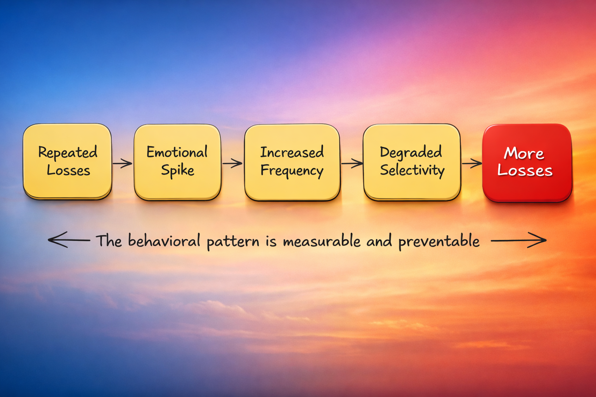
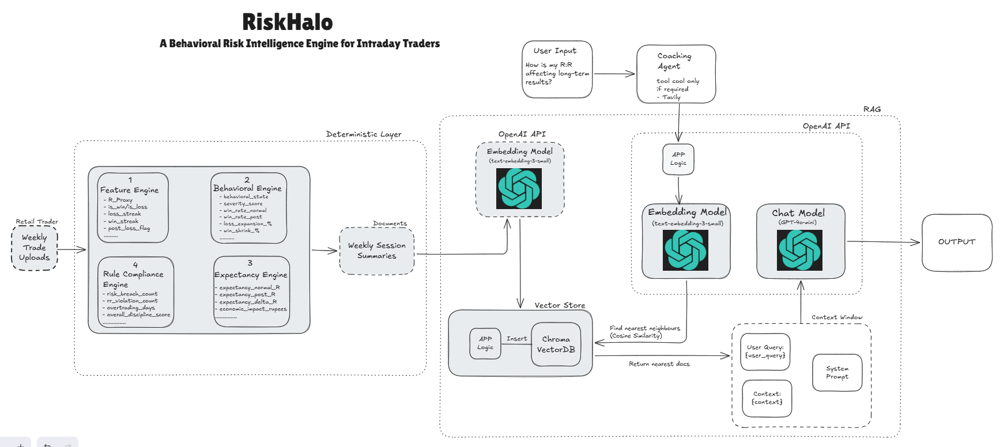
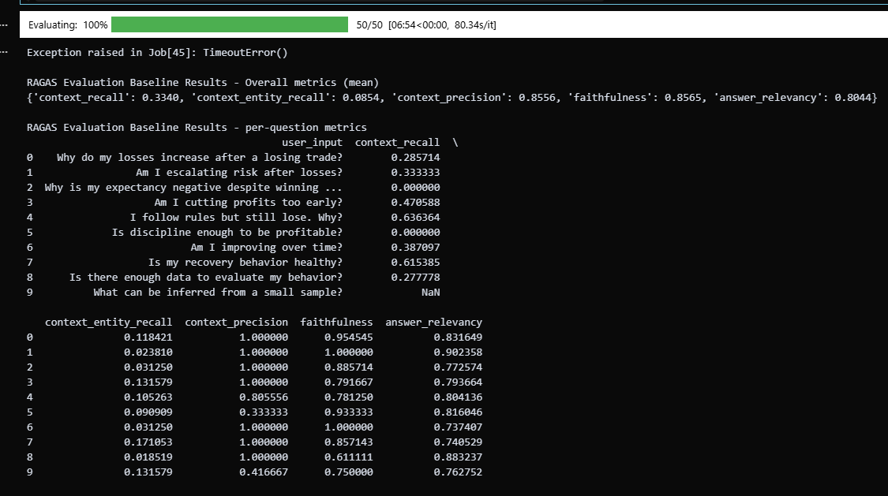
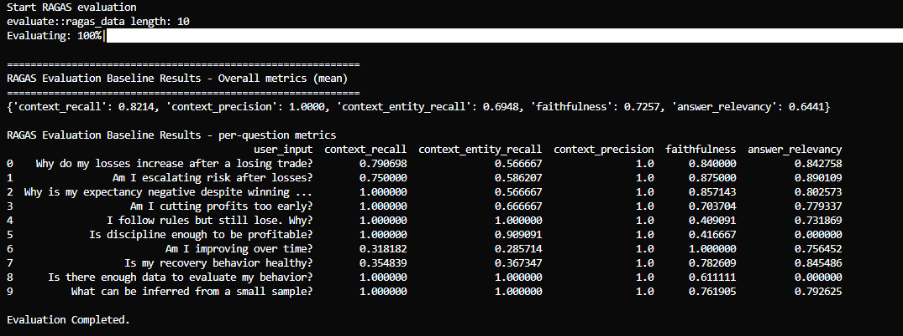
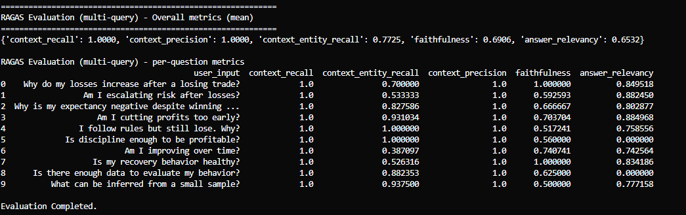

# AIE09 Certification Challenge

# RiskHalo - A Behavioral Risk Intelligence Engine for Intraday Traders

## Deliverables:

**### Task 1: Problem, Audience and Scope**

#### 1. Write a succinct 1-sentence description of the problem

Retail intraday traders frequently underperform not due to flawed strategies, but because emotional decision-making disrupts disciplined risk management - leading to overtrading, revenge trading, premature profit-taking and failure to cut losses according to predefined rules.

#### 2. Write 1-2 paragraphs on why this is a problem for your specific user

**RiskHalo** targets **Indian F&O intraday retail traders** - a segment where regulatory data from SEBI (Securities and Exchange Board of India) indicates that nearly 93% of participants incur losses, with approximately ₹3 lakh crore ($32.4 billion USD) lost over the past four years. This reflects a structural execution problem rather than isolated trading mistakes. As someone closely familiar with the challenges faced by intraday F&O traders, I have seen how emotional execution errors consistently outweigh strategic deficiencies. This practical exposure reinforces the need for a system focused on behavioral discipline and capital preservation rather than prediction.

A significant portion of retail traders struggle to consistently follow predefined risk rules. Despite consuming large amounts of market content and strategy material, they lack structured feedback on their execution behavior. Emotional responses such as overtrading, revenge trading, fear of missing out and premature profit-taking frequently override disciplined risk management. Without a systematic trading journal or visibility into recurring loss patterns, traders are unable to diagnose **behavioral distortions** and end up repeating the same execution errors, **leading to rapid drawdowns and eventual capital erosion**.

Beyond financial loss, the psychological impact is substantial. Repeated intraday losses increase stress and impulsivity, often pushing traders to trade more aggressively in an attempt to recover losses, further compounding risk. In an environment where most retail participants lose money, the absence of tools focused on behavioral discipline, risk containment and downside control creates a structural disadvantage. This makes emotional execution failure, rather than strategy selection - one of the primary drivers of trader attrition.

This is a problem worth solving because capital loss driven by emotional and undisciplined execution is the leading cause of retail trader churn in the F&O market.

#### 3. Create a list of questions or input-output pairs that you can use to evaluate your application

**Evaluation questions** - this will later form the RAGAS evaluation dataset

| Input | Expected Output |
|-------|----------------|
|Why do my losses increase after a losing trade?|ystem identifies whether LOSS_ESCALATION exists, references post-loss loss expansion metrics, and explains if risk increases conditionally after losses.|
|Is my behavior unstable after red days?|System evaluates behavioral_state and severity score, determines whether execution degrades post-loss, and states if instability is statistically supported.|
|Am I cutting profits too early?|System evaluates behavioral_state and severity score, determines whether execution degrades post-loss, and states if instability is statistically supported.|
|How is my R:R affecting long-term results?|System explains relationship between average R, expectancy, and win/loss size balance; highlights if low R on winners is suppressing profitability.|
|I follow rules but still lose. Why?|System distinguishes between behavioral stability and structural negative expectancy; clarifies that discipline does not guarantee profitability if edge is weak.|
|Are my winners too small?|System analyzes average win R and minimum R:R compliance; identifies whether profit compression exists.|
|Am I improving over time?|System compares severity, expectancy, and discipline scores across sessions and determines if trends show improvement, deterioration, or stability.|
|Is my recovery behavior healthy?|System evaluates ADAPTIVE_RECOVERY vs LOSS_ESCALATION and determines whether performance improves or deteriorates after losses.|
|When was my severity highest?|System identifies the session with the maximum severity_score and reports the corresponding behavioral_state.|
|When did expectancy drop most?|System compares expectancy_delta across sessions and identifies the session with the largest negative shift.|
|Am I improving compared to previous sessions?|System compares expectancy_delta across sessions and identifies the session with the largest negative shift.|
|Are wins shrinking after losses?|Win shrink %|
|Is trader stable under pressure?|STABLE/ADAPTIVE/CONTRACTION|

**### Task 2: Propose a Solution**

#### 4. Write 1-2 paragraphs on your proposed solution. How will it look and feel to the user? Describe the tools you plan to use to build it.

RiskHalo is designed as a Behavioral Risk Intelligence Engine that transforms raw trade data into structured behavioral diagnostics and actionable execution feedback. The system analyzes weekly trade uploads, computes deterministic performance and behavioral metrics and generates a structured session summary highlighting behavioral state classification, severity, expectancy shifts and rule compliance. RiskHalo focuses strictly on execution discipline, identifying whether performance degradation is driven by emotional distortion, structural expectancy issues, or rule violations.

From the user's perspective, the experience is simple and performance-focused. Each week, the trader uploads their trade data file and defines their risk per trade. Within seconds, RiskHalo generates a behavioral session summary that clearly shows whether the trader escalates risk after losses, shrinks winners under pressure, overtrades or violates daily loss limits. The interface then allows the trader to ask natural-language behavioral questions such as "Am I improving over time?" or "Are my losses increasing after red days?" The system responds with structured, data-backed insights grounded in their own historical sessions. Over time, RiskHalo becomes a performance journal with memory, enabling traders to track behavioral stability, severity trends and discipline improvements week over week. The benefit is measurable: traders gain objective feedback on execution quality, break emotional trading cycles and build disciplined risk consistency rather than chasing market predictions.

From a technical standpoint, the system is built using a modular architecture. A parsing layer processes structured trade data, followed by deterministic Feature, Behavioral, Expectancy and Rule Compliance engines. These engines are used to transform the trading raw data into structured behavioral diagnostics and then translated into session summaries. Session summaries are embedded using the OpenAI API and stored in a ChromaDB vector database to enable retrieval-augmented analysis across historical sessions. A multi-query retriever and structured system prompt power the coaching layer, ensuring responses remain grounded in session data. Evaluation is conducted using RAGAS to measure retrieval quality, faithfulness and behavioral grounding. The overall design prioritizes determinism, traceability and measurable performance improvement over heuristic or speculative outputs.

**This MVP is not about maximizing profits - it's about minimizing avoidable losses and controlling drawdown caused by emotional decision-making.**

#### 5. Create an infrastructure diagram of your stack showing how everything fits together.  Write one sentence on why you made each tooling choice.

| Sr.No. |Tool  |Tooling Choice Reason|
|-------|----------------|----------------|
|1|LLM(s) – OpenAI (gpt-4o-mini)|Chosen for its high performance, a 128K context window and cost effective pricing, provides decent intelligence which is enough for the certification challenege.|
|2|Agent Orchestration Framework – Lightweight Custom Orchestration (LangGraph-style flow)|Used to enforce deterministic control over retrieval, reasoning steps and structured response formatting without introducing unnecessary complexity.|
|3|Tool(s) - Deterministic Analytics Engines (Feature, Behavioral, Expectancy, Rule Compliance), Tavily API|Implemented as pure Python modules to ensure explainability, auditability and mathematically traceable behavioral diagnostics. Using Tavily API for web search as a tool to coaching agent.|
|4|Embedding Model – OpenAI Embeddings API (text-embedding-3-small)|Selected for high semantic quality and strong performance on financial and behavioral language, improving retrieval accuracy.|
|5|Vector Database – ChromaDB|Chosen for its lightweight setup, metadata filtering support and seamless integration for hybrid semantic + state-aware retrieval.|
|6|Monitoring Tool – Logging + RAGAS Metrics|Used to track retrieval quality, faithfulness and grounding performance in a measurable and reproducible way.|
|7|Evaluation Framework – RAGAS|Selected to quantitatively assess context recall, context precision, faithfullness, response relevancy|
|8|User Interface|ReactJS + Javascript on the frontend and Python on the backend, both are known tech|
|9|Deployment Tool - Vercel|Vercel for seamless and easy deployments.|
|10|Other Key Component – Multi-Query Retriever|Implemented to improve context recall by expanding user intent into multiple semantically aligned retrieval queries.|

#### 6. What are the RAG and agent components of your project, exactly?

**RAG Components in RiskHalo:**

a) **Document Source:**

    - Weekly Session Summaries
        - Generated by deterministic engines
        - Contain behavioral_state, severity_score, expectancy metrics, rule compliance metrics
        - Stored as structured narrative + metadata

b) **Embedding Layer:**

    - OpenAI Embedding Model
        - Converts session summaries into dense vector representations
        - Converts user queries into query embeddings

c) **Vector Store:**

    - ChromaDB
        - Stores: session_id, embedding vector, document (narrative summary), metadata (behavioral_state, severity_score, etc.)
        - Supports semantic similarity search
        - Supports metadata filtering (where={"behavioral_state": ...})

d) **Retriever:**

    - Multi-Query Retriever
        - Expands user question into multiple semantically aligned queries
        - Retrieves top-k relevant session summaries
        - Optionally applies behavioral_state metadata filter
        - Returns: retrieved_contexts, retrieved_metadatas
This is the core RAG retrieval mechanism.

e) **Generator:****

    - LLM (OpenAI GPT-4 class model)
        - Receives: System prompt, Retrieved session summaries, User question
        - Produces: Structured 4-section coaching response
This completes the RAG loop:
Query → Embed → Retrieve → Grounded Generate

**Agent Components in RiskHalo:**

a) **Coach Agent:**

    - This is your primary agent.
    - Responsibilities:
        - Calls retriever
        - Injects retrieved context into prompt
        - Enforces strict response structure
        - Ensures behavioral grounding
        - Prevents hallucination
        - It orchestrates the RAG flow.
        
    - It does NOT:
        - Compute metrics
        - Modify data
        - Calls Tavily API tool if required

It is a controlled reasoning agent.

b) **Deterministic Engines (Tool-like Components)**

    - While not traditional LLM tools, these act as deterministic sub-systems: 
        - FeatureEngine
        - BehavioralEngine
        - ExpectancyEngine
        - RuleComplianceEngine
These are invoked before RAG and provide structured truth.

**### Task 3: Dealing with the Data**

#### 7. Describe the default chunking strategy that you will use for your data. Why did you make this decision?

**Default Chunking Strategy:**

The default chunking strategy is session-level semantic chunking, where each weekly trading session summary is stored as a single self-contained document in the vector database. Each chunk includes structured behavioral metrics (behavioral_state, severity_score, expectancy metrics, rule compliance metrics) along with a narrative summary and associated metadata. No further splitting is performed within a session.

Chunking Strategy: Session level semantic chunking where *each weekly session summary = one chunk*

**Rationale:**

This decision was made because each weekly session summary is already a logically atomic and semantically coherent unit. Splitting sessions into smaller chunks (e.g: paragraph-level) would risk separating closely related behavioral metrics and weakening contextual integrity, thereby reducing grounding quality during retrieval. Since RiskHalo performs analysis at the session level (behavioral state and expectancy are computed per session), session-level chunking preserves metric cohesion, improves retrieval precision and aligns directly with the system's deterministic architecture.

#### 8. Describe your data source and the external API you plan to use, as well as what role they will play in your solution. Discuss how they interact during usage.

**Data Source**

The primary data source for RiskHalo is structured weekly trade data uploaded by the trader in Excel format. This dataset contains detailed transaction-level information including entry price, exit price, quantity, gross and net P&L, charges, turnover and trade dates. From this structured data, deterministic engines compute behavioral metrics (e.g: post-loss performance shifts), expectancy measures and rule compliance statistics. The trade file serves as the foundational input for all downstream behavioral classification and performance diagnostics.

Additionally, derived session summaries generated from this data become a secondary structured data source stored in the vector database. These summaries contain behavioral state classifications, severity scores, expectancy shifts and discipline metrics, which are used for retrieval-augmented analysis.

**External APIs**

1. OpenAI API

RiskHalo uses the OpenAI API for two core purposes:
    - Embedding API – To convert session summaries and user queries into dense vector embeddings for semantic retrieval.
    - LLM (Generation) API – To generate structured, grounded coaching responses based strictly on retrieved session summaries.

The OpenAI API is not used for computing behavioral metrics. All calculations are deterministic and handled internally to maintain explainability and auditability.

2. Tavily API (Web Search)

RiskHalo integrates the Tavily API as an external web search tool to support research-oriented or conceptual user queries. The Tavily tool is triggered only when user input contains specific research-intent keywords such as:
    
    - why
    - research
    - behavioral finance
    - psychology
    - study
    - studies
    - explain
    - theory

When these keywords are detected, the system performs a targeted web search to retrieve high-quality external references related to behavioral finance, cognitive biases or academic research. This allows RiskHalo to supplement session-based analysis with validated theoretical insights, while keeping performance diagnostics grounded in the trader's own data.

**How They Interact During Usage**

1. The trader uploads a weekly trade file (Excel).
2. The deterministic analytics layer parses the data and computes behavioral, expectancy, and rule compliance metrics.
3. A structured session summary is generated and embedded using the OpenAI Embeddings API.
4. The embedding and metadata are stored in ChromaDB.
5. When the trader asks a question:
    - The query is embedded and relevant session summaries are retrieved from ChromaDB.
    - If research-oriented keywords are detected, the Tavily API is triggered to retrieve relevant academic or conceptual references.
6. Retrieved session summaries (and optional Tavily research context) are passed to the LLM along with a strict system prompt.
7. The LLM generates a structured, data-grounded coaching response.

**### Task 4: Build End-to-End Prototype**

#### 9. Build an end-to-end prototype and deploy it to a local endpoint

**### Task 5: Evals**

#### 10. Assess your pipeline using the RAGAS framework, including the following key metrics: faithfulness, context precision, and context recall. Include any other metrics you feel are worthwhile to assess. Provide a table of your output results.

*RAGAS Evaluation Assessment — Iteration 1 (Baseline)*

In the initial version of the RiskHalo RAG pipeline, evaluation was conducted using persona-driven behavioral questions with a single concatenated raw document (all session summaries combined) as ground truth. Retrieval was purely semantic without behavioral-state filtering or multi-query expansion.

Key Metrics evaluated were --> Context Recall, Context Precision, Faithfulness, Context Entity Recall, Answer Relevancy

** BaseLine Results:**

*RAGAS Evaluation Baseline Results - Overall metrics (mean):*
*{'context_recall': 0.3340, 'context_entity_recall': 0.0854, 'context_precision': 0.8556, 'faithfulness': 0.8565, 'answer_relevancy': 0.8044}*

| Sr.No. |user_input  |Context Recall|Context Entity Recall|Context Precision|Faithfulness|Answer Relevancy|
|--------|------------|--------------|---------------------|-----------------|------------|----------------|
|1|Why do my losses increase after a losing trade?|0.285714|0.118421    |       1.000000  |    0.954545   |       0.831649  |
|2|Am I escalating risk after losses? |0.333333|0.023810    |       1.000000   |   1.000000    |      0.902358|
|3|Why is my expectancy negative despite winning|0.000000|0.031250     |      1.000000   |   0.885714   |       0.772574  |
|4|Am I cutting profits too early?|0.470588|0.131579    |       1.000000   |   0.791667       |   0.793664  |
|5|I follow rules but still lose. Why? |0.636364| 0.105263     |      0.805556  |    0.781250     |     0.804136|
|6|Is discipline enough to be profitable?|0.000000|0.090909   |        0.333333     | 0.933333      |    0.816046|
|7|Am I improving over time? | 0.387097|   0.031250     |      1.000000  |    1.000000      |    0.737407 |
|8|Is my recovery behavior healthy?|0.615385|0.171053   |        1.000000 |     0.857143    |      0.740529 |
|9|Is there enough data to evaluate my behavior?|0.277778|0.018519    |       1.000000  |    0.611111  |        0.883237|
|10|What can be inferred from a small sample? |NaN|  0.131579     |      0.416667    |  0.750000     |     0.762752|

*Ragas Evals baseline - Iteration 1*

#### 11. What conclusions can you draw about the performance and effectiveness of your pipeline with this information?

*Key Metrics Evaluated:*

*1. Context Recall:*

    - Measures whether the retriever fetched all relevant information required to answer the question.
    
    - Result: 0.3340
    - Interpretation: Retrieval covered only a small portion of the relevant behavioral information. The low score was primarily due to an inflated ground-truth scope (entire historical dataset used as reference), which artificially increased the recall denominator.

*2. Context Precision:*

    - Measures whether retrieved documents were relevant and free from noise.
    
    - Result: 0.8556
    - Interpretation: Retrieved content was largely relevant, indicating that semantic search was directionally correct but incomplete.

*3. Faithfulness:*

    - Measures whether the generated response strictly adhered to retrieved context without hallucinating unsupported claims.
    
    - Result: 0.8565
    - Interpretation: Despite retrieval limitations, responses remained well-grounded and did not fabricate metrics, reflecting strong prompt control.

*4. Context Entity Recall:*

    - Measures whether structured entities (behavioral_state, severity_score, expectancy metrics, discipline metrics) were correctly retrieved and referenced.
    
    - Result: 0.0854
    - Interpretation: Structured metric grounding was weak because retrieval did not consistently return the exact session blocks containing relevant entities.

*5. Answer Relevancy:*

    - Measures whether the response directly addressed the user’s question.
    
    - Result: 0.8044
    - Interpretation: The LLM generally answered the questions clearly and directly, even when retrieval coverage was incomplete.

**Overall Assessment — Iteration 1**

The baseline pipeline demonstrated strong generation discipline (high faithfulness and relevancy) but weak retrieval completeness (low recall and entity recall). The primary issue was not hallucination or reasoning quality, but retrieval architecture design - specifically, the use of a single concatenated ground-truth document and purely semantic search without metadata alignment.

This iteration revealed that:

    - The LLM reasoning layer was stable and well-controlled.
    - Retrieval architecture required refinement.
    - Evaluation framing significantly impacts recall metrics.

These insights directly informed the architectural improvements implemented in subsequent iterations (persona-aligned ground truth, metadata-aware retrieval, and multi-query expansion).

**### Task 6: Install an advanced retriever of your choosing in our Agentic RAG application**

#### 12. Choose an advanced retrieval technique that you believe will improve your application’s ability to retrieve the most appropriate context. Write 1-2 sentences on why you believe it will be useful for your use case.

**Iteration 2 - Advanced Retrieval Technique: Hybrid Retrieval (Dense + Metadata Filtering)**

In Iteration 1, the RAGAS evaluation revealed low context recall despite high faithfulness and precision. This indicated that while the LLM was disciplined and grounded, the retriever was not consistently surfacing all behaviorally relevant session summaries. Pure semantic similarity search was insufficient because many user questions in RiskHalo are implicitly state-specific (e.g., LOSS_ESCALATION, CONFIDENCE_CONTRACTION), yet the retriever had no structural awareness of behavioral classifications and other issue was the retrieval architecture design - specifically, the use of a single concatenated ground-truth document.

To address this, I implemented Hybrid Retrieval in Iteration 2 by combining dense vector similarity with deterministic metadata filtering using behavioral_state. This approach was chosen because RiskHalo's domain is structurally organized around session-level behavioral states computed by deterministic engines. By aligning retrieval with this ontology, it significantly improved context recall and entity grounding while maintaining high precision. Hybrid retrieval ensured that retrieved sessions were not only semantically relevant but also behaviorally aligned, making the evaluation more valid and the system more reliable.

**Iteration 3 - Advanced Retrieval Technique: Multi-Query Retrieval**

After implementing Hybrid Retrieval in Iteration 2, context recall improved significantly. However, I observed that certain abstract or behaviorally nuanced user questions were still not consistently retrieving the most comprehensive session context. Many trading-related questions are implicitly multi-dimensional (e.g: "Am I unstable after losses?" may relate to risk expansion, win shrinkage, expectancy shifts, or discipline breaches) and a single semantic query embedding may not fully capture all relevant angles.

To address this, I implemented Multi-Query Retrieval in Iteration 3, where the original user question is expanded into multiple semantically aligned variations before performing retrieval. This approach improves retrieval robustness by capturing different interpretations of user intent, increasing context coverage without sacrificing precision. For RiskHalo, where behavioral patterns can manifest across multiple metrics, multi-query retrieval ensures more complete behavioral grounding and significantly improves context recall across complex diagnostic questions.

#### 13. Implement the advanced retrieval technique on your application.

Implemented below:

Overall Retrieval Evolution

Iteration 1: Pure semantic dense retrieval --> limited coverage
Iteration 2: Hybrid retrieval (semantic + behavioral metadata alignment)
Iteration 3: Multi-query retrieval for robust intent coverage

These iterations progressively strengthened the retrieval layer from basic similarity search to a behaviorally-aware, intent-expanded retrieval architecture tailored to RiskHalo's structured behavioral intelligence use case.

#### 14. How does the performance compare to your original RAG application? Test the new retrieval pipeline using the RAGAS frameworks to quantify any improvements. Provide results in a table.

*Lets see the Ragas eval metrics for iteration 2 and iteratioon 3:*

**Iteration 2 Results - Advanced Retrieval Technique: Hybrid Retrieval (Dense + Metadata Filtering)**

**Iteration 3 Results - Advanced Retrieval Technique: Multi-Query Retrieval**

I evaluated the RAG pipeline using the RAGAS framework across the same persona-driven behavioral question set. The metrics assessed include
1. Context Recall
2. Context Precision
3. Context Entity Recall
4. Faithfulness
5. Answer Relevancy

**RAGAS Results Comparision:**

| Metric |Baseline  |Iteration 2 - Hybrid Metadata filtering|Iteration 3 - MultiQuery retreival|Improvement (from baseline to multiquery)|
|--------|----------|----------------------------------------|----------------------------------|-----------------------------------------|
|Context Recall|0.3340|0.8214|1.0| + 0.666|
|Context Precision|0.8556|1.0|1.0| + 0.1444|
|Context Entity Recall|0.0854|0.6948|0.7725| + 0.6871|
|Faithfulness|0.8565|0.7257|0.6906| - 0.1659|
|Answer Relevancy|0.8044|0.6441|0.6532| - 0.1512|

*Interpretation:*

Major Improvements:

1️. Context Recall (0.33 → 1.00)

The advanced pipeline achieved perfect retrieval coverage. Hybrid filtering ensured behavioral-state alignment, while multi-query expansion improved coverage for abstract and multi-dimensional questions.

2️. Context Entity Recall (0.08 → 0.77)

Structured metric grounding improved significantly. The retriever now consistently returns session summaries containing behavioral_state, severity_score, expectancy metrics and rule compliance summary.

3️. Context Precision (0.86 → 1.00)

No irrelevant session summaries were retrieved, demonstrating strong retrieval specificity.

*Tradeoffs Observed*

1. Faithfulness (0.86 → 0.69)

With broader context retrieval, the model performed more cross-session synthesis, slightly reducing strict literal grounding. This reflects increased reasoning breadth rather than hallucination.

2. Answer Relevancy (0.80 → 0.65)

Some responses became more analytical and expansive due to increased context, slightly reducing narrow question alignment in certain cases.

**### Task 7: Next Steps:**

#### 15. Do you plan to keep your RAG implementation via Dense Vector Retrieval for Demo Day? Why or why not?

Yes, I plan to retain Dense Vector Retrieval (enhanced with hybrid filtering and multi-query expansion) for Demo Day because it has demonstrated strong retrieval performance, achieving perfect context recall and precision in evaluation. The advanced retrieval architecture ensures that coaching responses are grounded in behaviorally relevant session summaries, which is critical for maintaining trust and explainability in a financial application.

While faithfulness slightly decreased due to broader synthesis, the tradeoff is acceptable given the significant improvement in retrieval completeness and entity grounding. For Demo Day, the priority is reliable behavioral alignment and robust coverage across diverse user questions, both of which are best supported by the current dense vector + hybrid + multi-query retrieval implementation.